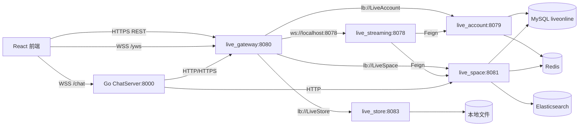

# 核心直播流程

## 总体架构



## 1. 登录与鉴权

1. 前端调用 `/account/signIn`。
2. `live_account/SignController.signIn` 根据手机号或邮箱 + 密码查 MySQL。
3. 登录成功后生成 `live_session` cookie，并把 cookie 值到 `User` 的映射写入 Redis hash `cookie_hash`。
4. 后续请求经过 `live_gateway/AuthenticationFilter`：
   - 从 cookie 取 `live_session`。
   - 从 Redis 取 `User`。
   - 向后端请求头写入 `x-user`。
5. 后端服务的 `live_common/AuthorityInterceptor` 根据注解做二次校验：
   - `@Remote`: 必须带内部远程调用 token。
   - `@RemoteNoLoginRequired`: 远程调用时允许无登录用户。
   - `@SuperAdmin`: 要求用户 `role >= 2`。

当前风险：密码明文比对、session Redis 无 TTL、`x-user` 是 URL 编码后的完整用户 JSON，安全边界主要依赖网关和硬编码内部 token。

## 2. 主播注册与房间基础信息

入口：`live_account/AnchorController.registerAnchor`

流程：

1. 用户提交主播注册信息。
2. 校验登录态、密码、身份信息。
3. `AnchorService.anchorRegister` 更新用户实名信息。
4. 插入 `anchor` 表。
5. 通过 HTTP 调用 `live_space/createRoomBase`。
6. `RoomBaseService.createRoomBase` 从 Elasticsearch 查询分类层级。
7. 插入 MySQL `room_info`，得到 `roomId`。
8. 在 Elasticsearch 创建 `RoomTag`，用于搜索和分类展示。

注意：账号服务和空间服务之间没有分布式事务；`AnchorService` 里通过 catch 后删除 anchor 模拟回滚，但对用户实名更新、ES 写入等边界不完整。

## 3. 创建直播场次

入口：前端 `spaceApi.createRoom` -> `/space/createRoom`

后端：`live_space/RoomDetailController.createRoom`

流程：

1. 根据 `x-user` 查询当前主播。
2. 根据主播 ID 查询 `room_info`。
3. 检查 `can_live`，被封播则拒绝开播。
4. 更新 Elasticsearch 中的房间标题。
5. 调用 `live_store/static/user/saveImage` 保存封面 base64，返回图片路径。
6. 构建 `RoomDetails(roomInfo, coverSrc)`。
7. 写入 Redis hash：`roomDetails:{roomId}`，包含房间基础信息、封面、在线用户列表、游客列表。

这一步只创建“在线直播间业务态”，还没有建立 WebRTC 媒体连接。

## 4. 主播开播信令

入口：前端 `component/Anchor/live.js`

流程：

1. 主播端调用 `getMediaStream` 获取摄像头/屏幕媒体流。
2. 创建 WebSocket：

```text
wss://{GATEWAY_HOST}/yws/webrtc_pub/{anchorId}/{roomId}
```

3. 网关把 `/yws/**` 转发到 `live_streaming:8078`。
4. `WebrtcHandshakeInterceptor.beforeHandshake`：
   - 解析 path：`webrtc_pub`、`id`、`roomId`。
   - 调用 `live_space/getRoom` 同步 Redis 在线房间态。
   - 校验用户登录态和主播身份。
   - 校验当前主播就是该房间 `anchorId`。
   - 在 `RoomWebRtcStoreManager` 创建本地内存房间。
5. `WebrtcHandler.afterConnectionEstablished`：
   - `RoomHandler.preOpenHandler` 调用 `live_space/updateLastLiveTime`。
   - `RoomWebRtcStore` 保存主播 WebSocket session。

主播 WebSocket 建立后，等待观众通过信令请求触发 P2P 连接。

## 5. 观众观看 WebRTC

入口：前端 `component/LiveVideo/watch.js`

流程：

1. 观众进入页面，先查询房间基础信息和在线态。
2. 创建 WebSocket：

```text
wss://{GATEWAY_HOST}/yws/webrtc_sub/{viewerId}/{roomId}
```

游客也允许进入，`who = -1`；登录用户为 `who = 0`；主播如果以观众身份进入自己的直播间会被降级为普通用户身份处理。

3. `WebrtcHandshakeInterceptor`：
   - 同步 `RoomDetails`。
   - 检查房间存在、未封播。
   - 检查主播 WebRTC session 已在线。
4. `RoomHandler.preOpenHandler`：
   - 登录用户写观看历史。
   - 调用 `live_space/enterRoom` 更新 Redis 房间成员列表。
5. `WebrtcRelay.register` 把观众 session 映射到目标房间。
6. 观众发送：

```text
reqRtc diy_split _
```

7. `WebrtcRelay` 将观众消息转发给主播，并包装成 `Letter(targetId, targetWho, msg)`。
8. 主播收到 `reqRtc` 后：
   - 为该观众创建一条 `RTCPeerConnection`。
   - 添加本地媒体流 track。
   - 创建 offer，经信令发回观众。
9. 观众设置 remote offer，创建 answer，经信令发回主播。
10. 双方继续转发 ICE candidate。
11. WebRTC 媒体流建立后，视频数据不再经过 Java 服务，而是在浏览器 P2P 之间传输。

当前架构含义：每增加一个观众，主播浏览器都会新增一条 PeerConnection 并复制上传媒体流，单主播并发规模主要受主播端上行带宽和浏览器连接能力限制。

## 6. 弹幕聊天

入口：前端 `Api/chat.js`

```text
wss://{CHAT_HOST}/chat/{roomId}/{userId}
```

Go 服务流程：

1. `Gws.CheckOrigin` 手动解析 path，得到 `roomId` 和 `userId`。
2. 从 cookie 调用 `live_gateway/account/getUser` 校验登录用户。
3. 调用 `live_space/getRoomInfo` 同步本地聊天室。
4. `Store.Room` 在 Go 进程内保存主播、用户、游客连接。
5. `OnMessage`：
   - 游客不能发言。
   - 检查本地禁言 map。
   - 将消息包装为 `UserMessage{message,user}` 广播给房间内其他连接。

禁言流程：

1. 前端调用 Go `/banedPost`。
2. Go 调用 `live_space/generateBannedPostRecord` 校验操作者权限并生成操作记录。
3. Go 将用户 ID 写入当前进程内 `Room.banPostList`。

注意：禁言状态不是持久化状态，也不跨 Go 实例同步。

## 7. 礼物与 DataChannel 通知

礼物结算入口：`live_account/UserController.sendGift`

流程：

1. 前端提交 `roomId` 和礼物列表到 `/account/sendGift`。
2. Account 通过 Space 查询房间对应主播。
3. `GiftService.sendGiftToAnchor`：
   - 使用 Redisson 锁保护用户资产和主播资产。
   - 从用户 JSON property 中扣减礼物价格。
   - 更新 Redis session 中的用户缓存。
   - 更新主播 `anchor_property` JSON。
4. 前端还会通过 WebRTC DataChannel 给主播端发送展示消息，用于实时礼物动画/提示。

当前风险：资产是 JSON 字符串字段，锁粒度粗，缺少独立流水和幂等请求号，后续应改为可审计的礼物账本模型。

## 8. 下播与封播

主播主动断开：

1. 主播 WebSocket 关闭。
2. `WebrtcHandler.afterConnectionClosed` 触发 `RoomHandler.preCloseHandler`。
3. `RoomWebRtcStoreManager.removeRoom` 关闭本地房间内全部 session。
4. 调用 `live_space/offlineRoom` 删除 Redis `RoomDetails`。
5. 更新 `lastLiveTime`。

管理员封播：

1. 前端调用 `/space/bannedLive`。
2. `ManageRoomController.bannedLive` 校验超管权限。
3. 将 `room_info.can_live` 更新为 0。
4. 调用 `live_streaming/offlineRoom` 关闭 WebRTC 房间。
5. 写入操作记录。

封播只阻断继续开播和当前信令连接；聊天服务对房间状态的感知依赖后续握手或本地删除逻辑，不是强一致广播。

