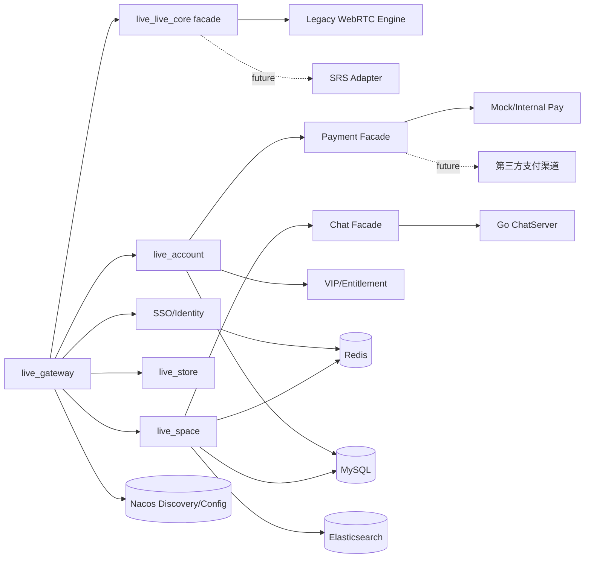

# Java 后端重构计划

## 目标与边界

本阶段优先维护 Java 后端模块。这是一次彻底重构，旧 cookie、旧 REST/WebSocket 协议不作为兼容约束；旧系统只作为业务语义和迁移数据的参考。核心直播业务语义不变。

### 本阶段目标

- 建设全新的 SSO/Identity 能力，采用明确的新认证协议和内部身份上下文。
- 引入不同 VIP 级别与权益判定能力。
- 提升安全性、代码规范、配置规范和测试基线。
- 抽象支付能力，先支撑站内充值/VIP 购买，后续可接第三方支付。
- 抽象直播核心能力，先适配当前 WebRTC P2P 方案，未来接入 SRS。
- 注册中心从 Eureka 迁移到 Spring Cloud Alibaba + Nacos。
- 抽象聊天能力，Go 聊天服务可作为当前聊天引擎 adapter，但新 Java 后端不绑定旧聊天协议。
- 明确分布式一致性、幂等、缓存、锁、事件和多实例问题。

### 暂不做

- 不以旧前端协议为约束；前端后续按新 API/新信令协议改造。
- 不立即重写 Go 聊天服务，但它只能作为可替换的聊天引擎实现。
- 暂不直接切 SRS 为唯一直播引擎。
- 暂不一次性拆分过多微服务；先在 Java 后端建立清晰边界和接口。

## 目标架构



说明：

- `live_gateway` 仍作为统一入口。
- 认证、VIP、支付、直播、聊天先建立 facade/interface，逐步替换内部实现。
- 当前直播实现归为 `LegacyWebRtcEngine`。
- SRS 作为后续 `SrsLiveEngine` 接入，不影响上层业务接口。
- Go ChatServer 通过 `ChatGateway` 或 `ChatFacade` 包装。新客户端协议应优先走网关或聊天 facade，不把旧直连 Go 协议作为目标约束。

## 模块调整建议

### 第一阶段尽量少拆服务

在现有模块内先建立包结构和接口：

| 模块 | 调整 |
| --- | --- |
| `live_gateway` | 统一认证入口、限流、CORS、灰度路由、Nacos discovery |
| `live_account` | 用户、主播、VIP、支付订单、资产账本先放这里，后续再拆 |
| `live_space` | 房间、关注、历史、举报、房管、聊天 facade、直播房间业务状态 |
| `live_streaming` | 当前 WebRTC P2P 信令实现，作为 legacy engine |
| `live_common` | 只保留真正公共的 DTO、错误码、拦截器、基础配置；避免继续堆业务模型 |
| `live_configuration` | 常量逐步迁移到配置文件/Nacos，减少硬编码 |
| `live_sso` | 作为 SSO/Identity 新实现的候选模块，可重命名或重建为 `live_identity` |

### 后续可拆服务

等接口稳定后再拆：

- `live_identity`: SSO、token、session、设备登录、权限上下文。
- `live_payment`: 订单、回调、渠道适配、账本。
- `live_vip`: VIP 套餐、权益、订阅周期、权益缓存。
- `live_live_core`: 直播引擎 facade、SRS adapter、legacy adapter。
- `live_chat_facade`: 聊天抽象、禁言、系统消息、Go ChatServer adapter。

## 迁移路线

### Phase 0：建立可构建基线

目标：先让后端工程可稳定构建和回归。

任务：

1. 修复 `live_platform/pom.xml` 中不存在的 `live_preview` 子模块问题。
2. 清理 jar、log、上传图片、前端 build 等运行产物出源码树。
3. 建立 `.gitignore`、`application-local.yml`、`application-dev.yml`、`application-prod.yml`。
4. 将数据库密码、keystore 密码、远程调用 token、TURN 密码移到环境变量或 Nacos 配置。
5. 建立 CI 最小门禁：
   - Maven compile/test。
   - Go test 暂保留。
   - 基础静态检查。
6. 补核心 smoke test：
   - 用户登录。
   - 创建直播间。
   - 开播/下播。
   - 进入房间。
   - 禁言。

验收：

- `mvn validate` 能通过。
- 每个 Java 服务可独立启动。
- 配置里没有明文敏感值。

### Phase 1：Eureka 迁移到 Nacos

目标：注册中心迁移为 Spring Cloud Alibaba + Nacos，保持服务名和 Feign 语义尽量不变。

策略：

1. 先引入 Nacos discovery，不立刻移除 Eureka。
2. 使用 profile 控制注册中心：
   - `eureka` profile 保留当前能力。
   - `nacos` profile 注册到 Nacos。
3. 网关路由仍使用 `lb://LiveAccount`、`lb://LiveSpace` 等服务名，先保证服务发现替换透明。
4. Feign Client 的 `value/name` 保持稳定，避免业务代码大面积修改。
5. Nacos Config 先承载普通配置，敏感配置走独立 secret 机制或环境变量注入。
6. 验证链路：
   - Gateway -> Account。
   - Gateway -> Space。
   - Streaming -> Space/Account。
   - Space -> Account/Store/Streaming。
7. Nacos 稳定后再移除 Eureka 依赖、注解和注册中心模块。

分布式注意点：

- Nacos 是注册与配置中心，不负责业务状态一致性。
- 不要把直播房间在线状态、支付状态、session 状态放到 Nacos。
- 服务名大小写、namespace、group、metadata 要统一规范。

验收：

- Java 后端在 Nacos profile 下能完整跑通主链路。
- Gateway 服务发现和 Feign 调用无业务代码感知。
- Eureka 模块可下线或仅保留兼容期。

### Phase 2：SSO 与安全底座

目标：建立统一身份认证中心和全新的认证协议，不兼容旧 `live_session` 方案。

#### SSO 设计

推荐采用 OAuth 2.1/OIDC 语义的 Identity 服务：

- `/oauth2/authorize`: 授权码入口。
- `/oauth2/token`: code 换 token，支持 PKCE。
- `/oauth2/jwks`: 公钥发布。
- `/oauth2/revoke`: token 撤销。
- `/userinfo`: 当前用户基础信息。
- `/logout`: 单设备或全设备登出。

浏览器端推荐：

- Authorization Code + PKCE。
- Access Token 使用短期 JWT。
- Refresh Token 使用 opaque token，服务端保存并轮转。
- Refresh Token 放 HttpOnly Secure SameSite Cookie 或由 BFF 托管，避免暴露给 JS。

服务端会话/令牌建议：

```text
sso:refresh:{refreshTokenId} -> RefreshTokenSession
sso:user:tokens:{userId} -> refreshTokenId set
sso:jti:blacklist:{jti} -> revoked marker
```

- refresh token 必须有 TTL、轮转和复用检测。
- access token 生命周期短，包含 `sub`、`role`、`vipLevel`、`scope`、`jti`、`iat`、`exp`。
- Gateway 校验 access token 后注入内部 `CurrentUserContext`。
- 内部服务只信任 Gateway 签名后的身份上下文或 mTLS 内网调用。
- 不再传完整 User JSON。

#### Gateway 认证职责

- 校验 access token 或 BFF session。
- 生成内部可信身份 header。
- header 必须带签名或仅内网 mTLS 可访问。
- 对公开资源、登录注册、OAuth2 回调等保留白名单。
- 对登录、支付、开播、送礼等接口增加限流。

#### 服务端鉴权职责

- Controller 不直接解析外部 token。
- 使用统一 `CurrentUser` 上下文。
- `@Remote`、`@SuperAdmin` 等注解收敛为统一权限注解。
- 服务间调用使用内部签名、mTLS 或服务身份，不使用硬编码远程 token。

安全改造任务：

1. 密码改 BCrypt/Argon2。
2. 若迁移存量账号，使用强制改密或一次性迁移策略，不保留明文密码逻辑。
3. 身份认证 mock 明确隔离到 local/dev profile。
4. Redis 禁用危险的 Jackson default typing 或改白名单序列化。
5. Go/Java 内部 HTTPS 不再跳过证书校验。
6. 统一 CORS 白名单，不能生产环境 `*`。
7. 敏感日志脱敏：手机号、邮箱、身份证、access token、refresh token。

验收：

- 新 SSO 协议可完成注册、登录、刷新、登出、撤销。
- refresh token 有 TTL、轮转和复用检测。
- 服务间身份不依赖完整 User JSON。
- 密码不再明文存储。

### Phase 3：新 API 契约、代码规范和后端分层

目标：降低后续重构成本。

统一分层：

```text
controller -> application service -> domain service -> repository/gateway adapter
```

规范：

- Controller 只做参数校验、协议转换、返回响应。
- Application service 编排跨领域流程。
- Domain service 放业务规则。
- Repository/Mapper 只处理持久化。
- Feign/HTTP 调用封装为 gateway adapter。

统一对象：

- `ApiResponse<T>`。
- `ErrorCode`。
- `PageResult<T>`。
- `CurrentUser`。
- `ServiceException`。
- `IdempotencyKey`。

新 API 契约：

- 所有新接口以 `/api/v1/**` 或按业务域版本化，不复用旧路径语义。
- 使用 OpenAPI 描述接口，接口先评审再编码。
- 错误响应采用统一错误码，必要时兼容 RFC 7807 `application/problem+json`。
- 登录、支付、开播、下播、封播、禁言、VIP 履约等写操作必须支持幂等 key。
- WebSocket/信令协议单独版本化，例如 `live.signal.v1`、`chat.ws.v1`。
- 禁止直接暴露内部数据库模型作为响应体。

工具和门禁：

- Checkstyle 或 Spotless。
- Maven Enforcer。
- 单元测试命名规范。
- Controller 契约测试。
- 禁止 `System.out.println`。
- 日志统一带 `traceId`、`userId`、`roomId`、`orderId`。

验收：

- 新代码必须通过格式化和静态检查。
- 核心接口错误返回结构统一。
- 关键跨服务调用有超时、重试、熔断策略。

### Phase 4：VIP 级别与权益能力

目标：不同 VIP 级别不散落在业务 if/else 中，而是通过权益系统判断。

核心模型：

```text
vip_plan
- id
- code
- name
- level
- duration_days
- status

vip_entitlement
- plan_id
- entitlement_code
- entitlement_value

user_vip
- user_id
- plan_id
- level
- start_time
- end_time
- status

vip_order
- order_id
- user_id
- plan_id
- pay_status
- activate_status
```

权益示例：

- `CHAT_BADGE`: 弹幕身份标识。
- `CHAT_RATE_LIMIT`: 发言频率。
- `LIVE_VIEW_QUALITY`: 可观看清晰度。
- `GIFT_DISCOUNT`: 礼物折扣。
- `ROOM_DECORATION`: 直播间装扮。
- `SUPPORT_PRIORITY`: 客服/举报优先级。

接口抽象：

```java
public interface VipQueryService {
    VipSnapshot getVipSnapshot(Long userId);
    boolean hasEntitlement(Long userId, String entitlementCode);
    Optional<String> getEntitlementValue(Long userId, String entitlementCode);
}
```

分布式注意点：

- VIP 生效以数据库为准，Redis/Caffeine 只做缓存。
- 支付成功激活 VIP 必须幂等。
- VIP 过期可用定时任务 + 查询时懒过期双策略。
- 权益配置变更需要缓存失效事件。

验收：

- 用户可拥有不同 VIP 等级。
- 任意业务只通过 `VipQueryService` 判定权益。
- VIP 激活、续费、过期可测试。

### Phase 5：支付能力抽象

目标：把充值、VIP 购买、未来礼物支付统一到支付抽象中，不再由业务直接改余额 JSON。

核心状态机：

```text
CREATED -> PAYING -> PAID -> FULFILLING -> FULFILLED
    |        |         |            |
    v        v         v            v
CLOSED    FAILED    REFUNDING    COMPENSATING
```

核心接口：

```java
public interface PaymentProvider {
    PaymentChannel channel();
    PaymentCreateResult createPayment(PaymentCreateCommand command);
    PaymentCallbackResult verifyCallback(PaymentCallback callback);
    RefundResult refund(RefundCommand command);
}

public interface PaymentApplicationService {
    PaymentOrder createOrder(CreateOrderCommand command);
    void handleProviderCallback(PaymentChannel channel, String rawBody, Map<String, String> headers);
}

public interface FulfillmentService {
    ProductType supportType();
    void fulfill(PaymentOrderPaidEvent event);
}
```

第一阶段 provider：

- `InternalMockPaymentProvider`: 本地/dev 使用。
- `BalanceRechargeFulfillment`: 充值到账。
- `VipFulfillment`: VIP 开通/续费。

未来 provider：

- 支付宝。
- 微信支付。
- Stripe 或其他渠道。

分布式注意点：

- 每个订单必须有全局唯一 `orderNo`。
- 支付回调必须按 `providerTradeNo + orderNo` 幂等。
- 订单状态更新用乐观锁或状态条件更新。
- 支付成功后的业务发放通过 outbox event，失败可重试。
- 不能在支付回调线程里做不可控长事务。
- 所有资金变更写账本，不直接覆盖用户资产 JSON。

建议账本模型：

```text
account_ledger
- ledger_id
- user_id
- account_type
- direction
- amount
- biz_type
- biz_id
- balance_after
- created_at
```

验收：

- 充值不再直接改 `user.property`。
- VIP 购买走支付订单和履约。
- 重复回调不会重复加钱或重复开通 VIP。

### Phase 6：直播核心能力抽象

目标：当前 WebRTC P2P 实现继续可用，但上层业务不再绑定具体信令实现，为 SRS 接入做准备。

#### 抽象边界

直播业务分两层：

1. 直播间业务状态：由 `live_space` 管理。
2. 直播媒体/信令引擎：由 `LiveEngine` 管理。

核心接口：

```java
public interface LiveEngine {
    LiveEngineType type();
    StartPublishResult startPublish(StartPublishCommand command);
    JoinLiveResult joinLive(JoinLiveCommand command);
    void leaveLive(LeaveLiveCommand command);
    void stopLive(StopLiveCommand command);
    LiveEngineRoomStatus queryStatus(Long roomId);
}
```

当前实现：

```text
LegacyWebRtcEngine -> live_streaming 当前 WebSocket P2P 信令
```

未来实现：

```text
SrsLiveEngine -> SRS HTTP API / WebRTC publish/play / callback
```

对上层保持稳定：

- `createRoom` 不直接知道 WebRTC 或 SRS。
- `enterRoom` 不直接操作具体信令 session。
- `offlineRoom` 通过 `LiveEngine.stopLive`。
- 封播通过业务状态 + 引擎 stop 双重保证。

#### SRS 预留点

需要预留的概念：

- `streamKey`。
- `publishUrl`。
- `playUrl`。
- `rtcPlayUrl`。
- `engineRoomId`。
- `engineStreamId`。
- `callbackSecret`。
- `publishToken`。
- `playToken`。

SRS 接入时优先做 adapter，不改业务流程：

1. 主播开播申请 publish token/url。
2. 前端或推流端使用 SRS publish 地址。
3. 观众进入房间获取 play 地址。
4. SRS callback 通知 publish/unpublish/play/stop。
5. Java 后端根据 callback 修正房间在线态。

分布式注意点：

- 房间状态更新必须幂等。
- 开播/下播使用 roomId 维度锁，避免重复开播和旧连接误删新直播。
- SRS callback 可能乱序、重复、延迟，必须按版本号或 sessionId 判断。
- 在线人数不能靠单实例内存，应该来自 Redis 计数/集合或 SRS 统计回调。
- 直播状态落库，Redis 只做实时缓存。

验收：

- 当前 WebRTC P2P 能通过 `LegacyWebRtcEngine` 跑通。
- `live_space` 不再直接依赖 `live_streaming` 细节。
- 新增 SRS adapter 时不需要重写用户、VIP、支付、举报、房管等业务。

### Phase 7：聊天能力抽象

目标：定义新的聊天能力边界。Go 聊天服务可暂留为一个底层聊天引擎 adapter，但新 Java 后端和新客户端协议不绑定旧 Go WebSocket 路径。

抽象接口：

```java
public interface ChatService {
    void ensureRoom(ChatRoomCommand command);
    void closeRoom(Long roomId);
    void banUser(ChatBanCommand command);
    void unbanUser(ChatBanCommand command);
    boolean isBanned(Long roomId, Long userId);
    void sendSystemMessage(ChatSystemMessage command);
}
```

当前实现：

```text
GoChatServiceAdapter -> 调用 Go ChatServer HTTP API
```

短期策略：

- 新聊天协议由 Java `ChatService`/网关定义。
- Go 服务可以继续负责实际弹幕广播，但隐藏在 adapter 后。
- Java 只通过 `ChatService` 管理禁言、系统消息、房间开关。
- 禁言记录以 Java 数据库为准，Go 内存状态只是投递执行状态。

分布式注意点：

- 禁言状态持久化到 Java 后端或 Redis，Go 启动/房间同步时读取。
- Go 多实例时必须有共享状态或消息总线。
- 系统消息要支持至少一次投递和幂等 messageId。

验收：

- 禁言记录不因 Go 重启丢失。
- Java 后端调用聊天能力只依赖 `ChatService`。
- 新客户端不直接依赖旧 Go WebSocket 路径。

## 分布式设计原则

### 状态归属

| 状态 | 权威存储 | 缓存/派生 |
| --- | --- | --- |
| 用户身份 | MySQL + SSO session Redis | Gateway local cache 可选 |
| VIP 权益 | MySQL | Redis/Caffeine |
| 支付订单 | MySQL | 无，必要时 Redis 防重复提交 |
| 资金账本 | MySQL | 只读缓存 |
| 房间基础信息 | MySQL | Redis/ES |
| 在线直播场次 | MySQL 状态 + Redis 实时态 | LiveEngine 内存态 |
| WebRTC session | 当前 live_streaming 内存，未来 SRS | Redis 只存索引/状态 |
| 弹幕连接 | Go ChatServer 内存 | Redis/MQ 用于多实例 |
| 禁言记录 | MySQL/Redis | Go 内存执行缓存 |
| 举报记录 | MySQL | Redis 可缓存 |

### 一致性策略

- 用户资产、支付、VIP：强一致，数据库事务 + 幂等 + outbox。
- 房间在线人数：最终一致，Redis/SRS 统计为准。
- 弹幕：允许最终一致和少量丢失，但禁言必须持久化。
- 下播/封播：业务状态强一致，引擎关闭最终一致并可重试。

### 幂等要求

必须设计幂等 key：

- 登录刷新。
- 创建支付订单。
- 支付回调。
- VIP 开通。
- 创建直播场次。
- 开播。
- 下播。
- 封播。
- 禁言/解禁。
- 举报提交。

### 锁策略

避免全局锁：

- 用户资产锁：`lock:user:asset:{userId}`。
- 主播资产锁：`lock:anchor:asset:{anchorId}`。
- 房间状态锁：`lock:room:live:{roomId}`。
- 支付订单锁：`lock:payment:{orderNo}`。

能用数据库条件更新和唯一索引解决的，不优先用分布式锁。

## 推荐里程碑

| 里程碑 | 周期 | 交付 |
| --- | --- | --- |
| M0 | 1 周 | Maven 结构修复、配置外置、CI compile/test |
| M1 | 1-2 周 | Nacos discovery/config profile 跑通，Eureka 进入兼容期 |
| M2 | 2-3 周 | OIDC/SSO token、密码 hash、网关身份上下文、安全加固 |
| M3 | 2 周 | 统一响应、错误码、异常、日志、代码规范门禁 |
| M4 | 2-3 周 | VIP 级别、权益模型、权益查询服务 |
| M5 | 3-4 周 | 支付订单、mock provider、充值/VIP 履约、账本 |
| M6 | 3-4 周 | `LiveEngine` 抽象、Legacy WebRTC adapter、房间状态机 |
| M7 | 2 周 | ChatService 抽象、Go adapter、禁言持久化 |
| M8 | PoC | SRS adapter，发布/观看/回调链路验证 |

## 第一批建议落地任务

1. 修复 Maven 父子模块结构。
2. 新增统一响应和错误码，不改业务行为。
3. 新增 `CurrentUser`，替代传完整 `User` JSON 的内部使用。
4. 建立 OIDC/SSO token 与 refresh token 轮转模型。
5. 引入 Nacos profile，但保留 Eureka profile。
6. 在 `live_streaming` 定义 `LiveEngine` 接口，并用当前实现做 legacy adapter。
7. 在 `live_space` 定义 `ChatService` 接口，并用 Go HTTP API 做 adapter。
8. 新建支付订单表和 mock 支付 provider，先不接真实支付。
9. 新建 VIP plan/user_vip/entitlement 表和查询服务。
10. 为登录、开播、下播、支付回调、VIP 开通补集成测试。
